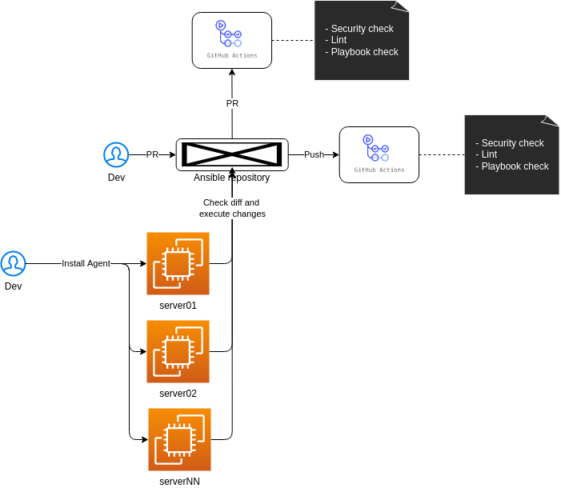

# **Ansible GitOps Agent for GitHub** 

So basically, this role will configure a gitops agent to run via crontab or systemd timer on Linux servers, checking diff from the main branch and after that, executing `ansible-playbook` commands for each role provided in the group vars.

- Dependencies
  - Ansible installed and pre-configured on the host that will run the agent (Installed by the gitops_agent role).
  - Var file and a role that need to be monitored by the gitops agent.

The flow can be observed from the **diagram** of the image below.



Group Vars example:
```yaml
base_info:
  name: gitops_agent example
  owner: kaio6fellipe
  repository: ansible-devops
  branch: development

monitored_roles:
  - name: common
    tag: common
    path: /roles/common

extra_var_files:
  - name: global_dev_vars.yaml
    path: /group_vars/dev/global_dev_vars.yaml

vault_password: some_encrypted_password_with_ansible_vault
vault_user_auth: some_encrypted_user_for_github_auth
vault_personal_access_token: some_encrypted_github_pat

```