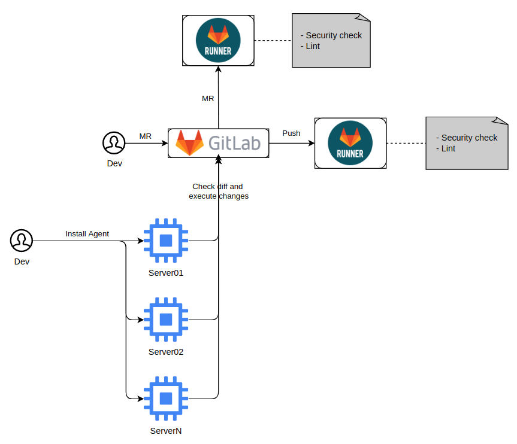

# **Ansible GitOps Agent for GitLab** 

So basically, this role will configure a gitops agent to run via systemd timer on Linux servers, checking diff from the main branch and after that, executing `ansible-playbook` commands for each role provided in the group vars.

- Dependencies
  - Ansible installed and pre-configured on the host that will run the agent (Installed by the gitops_agent role).
  - Var file and a role that need to be monitored by the gitops agent.

The flow can be observed in the image below.

The diagram represents the flow used by this agent in his entire life cycle.
1. First of all, the Dev have to install it on the server, providing the var(s) file(s) and the role(s)
2. With GitOps Agent Installed, the first synchronization will be started, looking for the information that is in the provided branch
3. After the service bootstrap, the service will run every 30 minutes, whenever a change is identified in the branch, it will apply these changes without the need for manual intervention



Group Vars example:
```yaml
base_info:
  name: gitlab gitops_agent example
  project_id: 1
  branch: master
  gitlab_domain: gitlab.domain.com.br

monitored_roles:
  - name: firewall
    tag: firewall
    path: /roles/firewall

extra_var_files:
  - name: vars.yml
    path: /groups/platform/edge/control_plane/dev/ansible/inventory/group_vars/all/vars.yml

vault_password: some_encrypted_password_with_ansible_vault
vault_personal_access_token: some_encrypted_gilab_pat

```